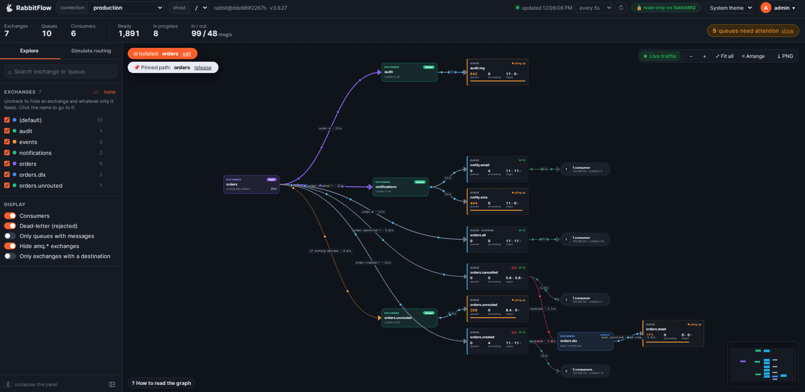
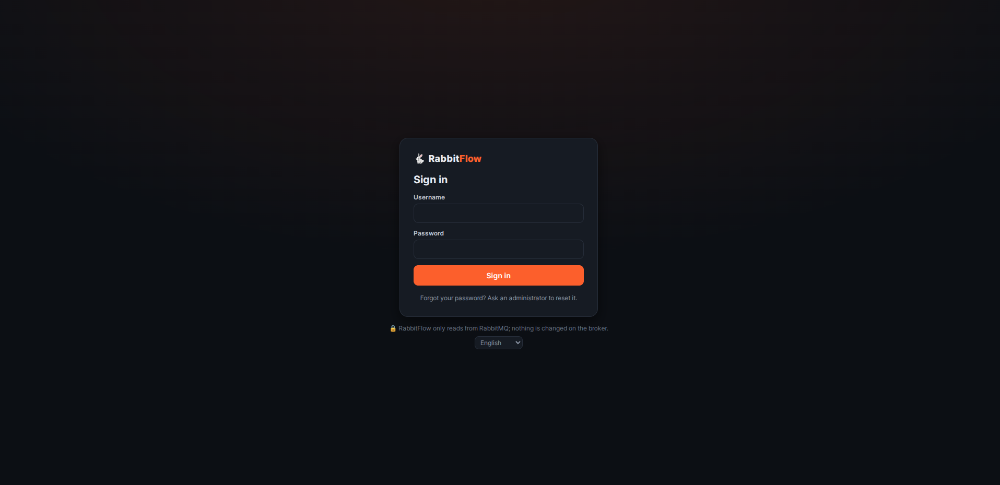

# RabbitFlow

See your messages flowing through RabbitMQ. RabbitFlow draws a RabbitMQ topology as a graph:
exchanges → bindings → queues → consumers. It shows dead-letter and alternate-exchange paths, live
metrics and traffic, and can simulate routing.

**Read-only on RabbitMQ.** RabbitFlow only sends `GET` requests to the Management API. It never
publishes, creates, changes or deletes anything on the broker.

The labels in parentheses below are the Portuguese ones, for when the app is in Portuguese.



## Features

- **Summary bar**: exchanges, queues, consumers, queued and unacked messages, message rates and alerts.
  Clicking an alert highlights the queues that are piling up and where their messages come from.
- **Graph** with automatic layout. Each node shows what it is. Each queue shows its status (OK / piling up /
  no consumer / stopped) and a depth bar.
- **Stable layout**: drag nodes anywhere. Positions and zoom are saved in the database per user,
  connection and vhost, so nothing rearranges by itself, and new nodes are placed next to their neighbours.
  **Arrange** (*Organizar*) re-runs the automatic layout and can be undone.
- **Live traffic** (*Tráfego ao vivo*): dots move along the edges with real traffic. More dots and thicker edges mean
  higher rates, and each edge label shows msg/s.
- **Follow the flow**:
  - hover a node to light up everything upstream and downstream of it;
  - **pin** a path (*Fixar caminho*): double-click a node or use the details panel; `Esc` releases it;
  - **isolate** a node (*Isolar no grafo*) to hide everything outside its flow.
- **Details panel**: clickable *Receives from* / *Delivers to* (*Recebe de* / *Entrega para*) links let you walk the topology.
- **Explore** (*Explorar*):
  - search;
  - an exchange list: click to jump to an exchange, or untick it to hide what only that exchange feeds;
  - display options: consumers, dead-letter, only queues with messages, hide `amq.*`, only exchanges with a destination.
- **Export PNG** of the whole graph (independent of zoom), with RabbitFlow branding. The side panel
  collapses (button at its bottom, or `[`) for clean screenshots.
- **Routing simulation** (*Simular roteamento*):
  - build a message (exchange, routing key with suggestions from the bindings, headers, body) and send it;
  - a dot travels hop by hop to the queues and consumers, and each node shows the outcome:
    *published*, *queued*, *consumed* or *dropped*;
  - it runs entirely in the browser, so nothing is published;
  - it supports direct, topic (`*`/`#`), fanout, headers (`x-match` all/any/-with-x), the default
    exchange, exchange-to-exchange bindings and alternate exchanges, but not plugin exchange types
    (e.g. consistent-hash).
- Light and dark themes.
- **Languages**: Portuguese, English and Spanish. Pick one on the login screen or in the user menu; it is
  saved in the user's account. Before login, the browser language is used.

Tested with RabbitMQ 3.9.27 and 4.x.

## Quick start (Docker)

```bash
cp .env.example .env          # optional: port, session, encryption key
docker compose up -d --build  # http://localhost:4100
```

Open the app, create the administrator account (*Criar conta de administrador*), then add a RabbitMQ connection.

The container runs as a non-root user with a read-only filesystem (except `/data`) and has a
healthcheck on `/healthz`.

## Kubernetes (Helm)

The chart in `helm-app-template/` runs RabbitFlow with a persistent volume at `/data`.
Its values are in `helm-app-template/helmvalues/values.yaml`.

```bash
docker build -t <your-registry>/rabbitflow:1.0.0 . && docker push <your-registry>/rabbitflow:1.0.0
# set image.repository in values.yaml, then:
helm install rabbitflow ./helm-app-template -n rabbitflow --create-namespace \
  -f helm-app-template/helmvalues/values.yaml
kubectl -n rabbitflow port-forward svc/rabbitflow 8080:4100   # http://localhost:8080
```

Keep a single replica: the SQLite database lives on a `ReadWriteOnce` volume. If you expose RabbitFlow
over HTTPS (HTTPRoute), set `COOKIE_SECURE` and `TRUST_PROXY` to `"1"`.

## RabbitMQ connections

Connections are managed in the app, not in `.env`.

- **Administrators** add, edit, test and remove connections: a name, the Management API URL (port
  `15672`), a username and a password. Open them from the user menu → **Connections** (*Conexões*), or from
  *Manage connections…* (*Gerenciar conexões…*) in the connection selector.
- **Everyone** picks a connection in the selector at the top, next to the vhost.
- Connection passwords are **encrypted** in the database (AES-256-GCM) and never sent back to the
  browser. The key comes from `RABBITFLOW_SECRET_KEY`. If it is not set, the key is generated once in
  `<DATA_DIR>/secret.key`. If the key changes, saved passwords have to be entered again.
- Inside the container `localhost` is the container itself. For a RabbitMQ running on your machine, use
  `http://host.docker.internal:15672`. Inside Kubernetes, use the service address, e.g.
  `http://rabbitmq.<namespace>.svc:15672`.
- Use a RabbitMQ user with the `monitoring` tag.

## Users and access



- **First run**: with no users, RabbitFlow shows **Create administrator account** (*Criar conta de administrador*). Do this right after
  deploying, because the first person to open the app becomes the administrator.
- **Administrators** (user menu → **Users** / *Usuários*):
  - create and remove users, grant or revoke administrator rights, and reset passwords;
  - a new user gets a **temporary password**, shown only once, and must set their own password on first login;
  - there is always at least one administrator.
- **Everyone** can change their own password (user menu → **Change password** / *Alterar senha*). Changing or resetting a
  password ends the user's other sessions.
- **Locked out with no other administrator?**
  ```bash
  docker compose exec rabbitflow node server/dist/cli.js reset-password <username>
  docker compose exec rabbitflow node server/dist/cli.js list-users
  ```
- Passwords are hashed with scrypt. Sessions last `SESSION_DAYS` and are renewed on use, up to
  `SESSION_MAX_DAYS`. Failed logins are limited per IP and account (5) and per IP (30) for 15 minutes.
  Behind a reverse proxy, set `TRUST_PROXY=1` so limits use the real client IP.

## Data

Users, sessions, connections and each user's graph layout live in SQLite under `/data` (the
`rabbitflow-data` Docker volume, or the PVC on Kubernetes).

## Configuration (`.env`)

| Variable | Default |
| --- | --- |
| `PORT` | `4100` |
| `SESSION_DAYS` | `7` (idle timeout, renewed on use) |
| `SESSION_MAX_DAYS` | `30` (absolute session lifetime) |
| `COOKIE_SECURE` / `TRUST_PROXY` | `0` (`1` behind HTTPS / a reverse proxy) |
| `RABBITFLOW_SECRET_KEY` | empty → key generated in `<DATA_DIR>/secret.key` |
| `DATA_DIR` | `data/` in development, `/data` in the container |

## Development

```bash
npm install
npm run dev                                          # server :4100 + web http://localhost:5173
npm test                                             # web and server tests
npm run cli -w server -- reset-password <username>   # CLI in dev mode (database in data/)
```

## How read-only is enforced

- The RabbitMQ client only issues `GET` requests to the Management API, including *Test connection*.
- The backend accepts writes only on RabbitFlow's own routes (login, users, connections, layout), which
  are stored in its SQLite database. Any other write is rejected with `405`.
- The routing simulation runs in the browser.
- Responses from the RabbitMQ URL are never echoed back and redirects are not followed, so a connection
  cannot be used to read other internal services.
- Security headers (CSP, `frame-ancestors 'none'`, `nosniff`, `no-referrer`, HSTS over HTTPS) are sent on every response.
